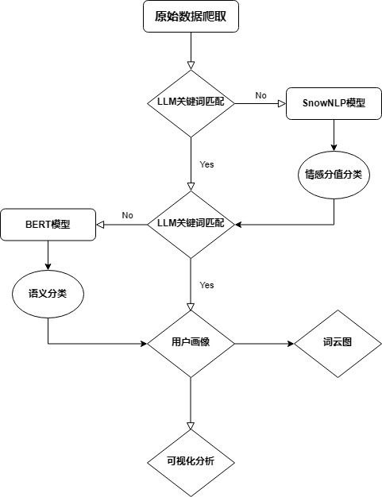

# Market Response Analysis: Insta360 GO Ultra

Sentiment, topic and user-segmentation analysis of **2,324 viewer comments** on a hands-on review video of the Insta360 GO Ultra, capturing user attitudes and affective responses toward a consumer technology — combining rule-based scene detection, SnowNLP sentiment grading, BERT-based user-type classification, and Power BI dashboards.



---

## Contents

| Path | Description |
|---|---|
| `code/` | Analysis pipeline: sentiment labeling, user-type classification, word clouds |
| `data/` | Raw crawled comments and labeled datasets |
| `visualization/` | Power BI report, 16 word clouds, pipeline diagrams |
| `report/` | Full written report (PDF / DOCX) |

## Motivation

Understanding how people perceive and emotionally respond to new technologies — studied here through naturally expressed comments rather than prompted survey responses.

## Method

Four sequential stages:

1. **Data collection** — crawled 2,324 comments from a review video of the Insta360 GO Ultra (viewer field: username, gender, comment text, likes, IP region).
2. **Sentiment & scene labeling** — a two-stage rule system, scene first and sentiment second:
   - *Scene detection* via keyword matching: comparisons against competitors (DJI, GoPro, …) are labeled **competitor advantage**; worry-related terms (battery, safety, durability, …) are labeled **usage concerns**.
   - *Sentiment grading* with SnowNLP, split into five tendency levels to reduce the ambiguity of a single "neutral" bucket: core positive (> 0.7), mild positive (0.55–0.7), purely neutral (0.45–0.55), mild negative (0.3–0.45), negative (< 0.3).
3. **User-type classification** — keyword anchoring for comments with explicit signals, with a BERT model (`bert-base-chinese`, 5-way head) handling ambiguous texts: daily recorder, travel & outdoor, professional creator, vlogger, first-time trier.
4. **Visualization** — jieba tokenization + `wordcloud` by dimension (gender, sentiment label, user type) after stop-word filtering; multi-dimensional exploration in Power BI (region, gender, user type, sentiment).

## Sentiment distribution (n = 2,000 labeled comments)

| Label | Count | Share |
|---|---:|---:|
| Core positive | 635 | 31.8% |
| Negative | 490 | 24.5% |
| Purely neutral | 331 | 16.6% |
| Mild positive | 241 | 12.1% |
| Mild negative | 211 | 10.6% |
| Usage concerns | 62 | 3.1% |
| Competitor advantage | 30 | 1.5% |

## User segments (n = 2,000)

| Segment | Count | Share |
|---|---:|---:|
| First-time trier | 1,718 | 85.9% |
| Travel & outdoor | 146 | 7.3% |
| Daily recorder | 121 | 6.1% |
| Vlogger | 12 | 0.6% |
| Professional creator | 3 | 0.2% |

## Key findings

- **Overall acceptance with clear room for improvement** — positive sentiment accounts for over 43% of labeled comments while negative sentiment reaches 35%.
- **Affective responses vary sharply across user segments** — the dominant first-time-trier group is emotionally polarized (27.9% core positive vs 25.7% negative); vloggers express the strongest negative sentiment of any segment, while daily recorders keep stable positive affect.
- **Extremely concentrated user structure** — first-time triers make up 85.9% of the audience, indicating a consumer / entry-level product position; professional creator and vlogger segments together are below 1%, leaving the professional market largely untapped.
- **Competitive threats are non-negligible** — although competitor-advantage (30) and usage-concerns (62) labels are small in volume, they concentrate exactly where purchase decisions are made.
- **Strong regional polarization** — Guangdong leads both core positive (111) and negative (89) counts; Zhejiang and Jiangsu show stable, high satisfaction, while overseas markets (Japan, US) remain low-penetration.
- **Gender imbalance is a limitation** — female users are only 9.2% of the sample, so conclusions reliably describe male and undisclosed-gender users only.

Word clouds by dimension are in `visualization/wordclouds/`; the interactive dashboard is in `visualization/insta360_dashboard.pbix`.

## Repository layout

```
.
├── code/
│   ├── sentiment_analysis.py        # stage 2: scene + sentiment labeling
│   ├── user_classification.py       # stage 3: BERT user-type classification
│   └── wordcloud_visualization.py   # stage 4: word clouds by dimension
├── data/
│   ├── comments_raw.csv             # crawled comments (input)
│   ├── comments_labeled_sentiment.csv
│   ├── comments_labeled_full.csv    # sentiment + user type (final dataset)
│   └── visualization_dataset.xlsx   # dataset used for the BI dashboard
├── visualization/
│   ├── insta360_dashboard.pbix      # Power BI report
│   ├── insta360_dashboard.pdf       # exported dashboard
│   ├── flowcharts/                  # pipeline diagrams
│   └── wordclouds/                  # 16 word clouds
└── report/
    └── project_report.pdf           # full report (12 pages)
```

## Getting started

```bash
pip install -r requirements.txt

python code/sentiment_analysis.py        # data/comments_raw.csv -> data/comments_labeled_sentiment.csv
python code/user_classification.py       # -> data/comments_labeled_full.csv
python code/wordcloud_visualization.py   # -> visualization/wordclouds/
```

- Comment text is stored in the column `评论内容` (Chinese column names are kept for compatibility with the original data).
- `user_classification.py` optionally loads fine-tuned weights (`insta360_user_type_model.pth`); without them it falls back to the base `bert-base-chinese` model with keyword anchoring.
- If your network requires a proxy for model downloads, set `HTTP_PROXY` / `HTTPS_PROXY` before running.
- Word-cloud scripts assume a Chinese font (SimHei / Microsoft YaHei, Windows); substitute an available CJK font on other platforms.

## Limitations

- Single video source and a single time window — findings describe the audience of one review channel, not the whole market.
- SnowNLP scores are used as heuristic thresholds rather than calibrated probabilities.
- Female and overseas samples are too small for reliable segment-level conclusions.

## Data

Datasets are collected from public comment sections of a review video and contain only information already visible to any viewer (username, public comment text, likes, IP region). No private data is included.
